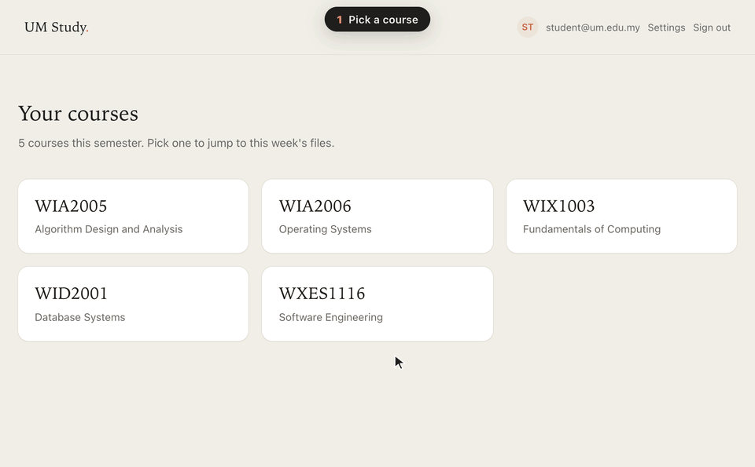
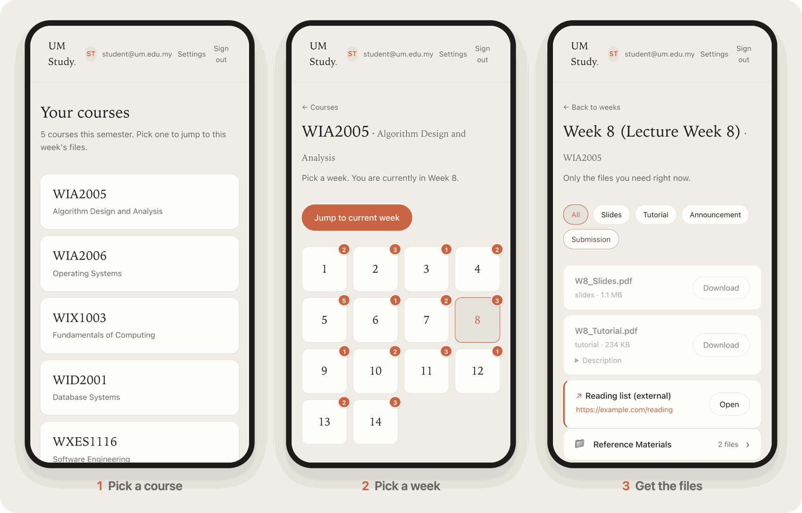
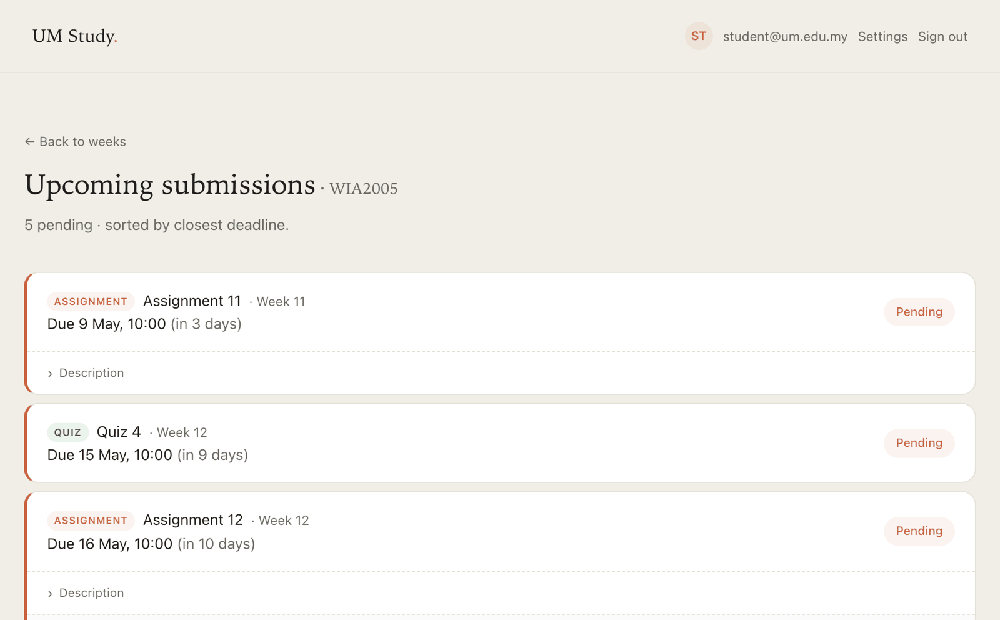
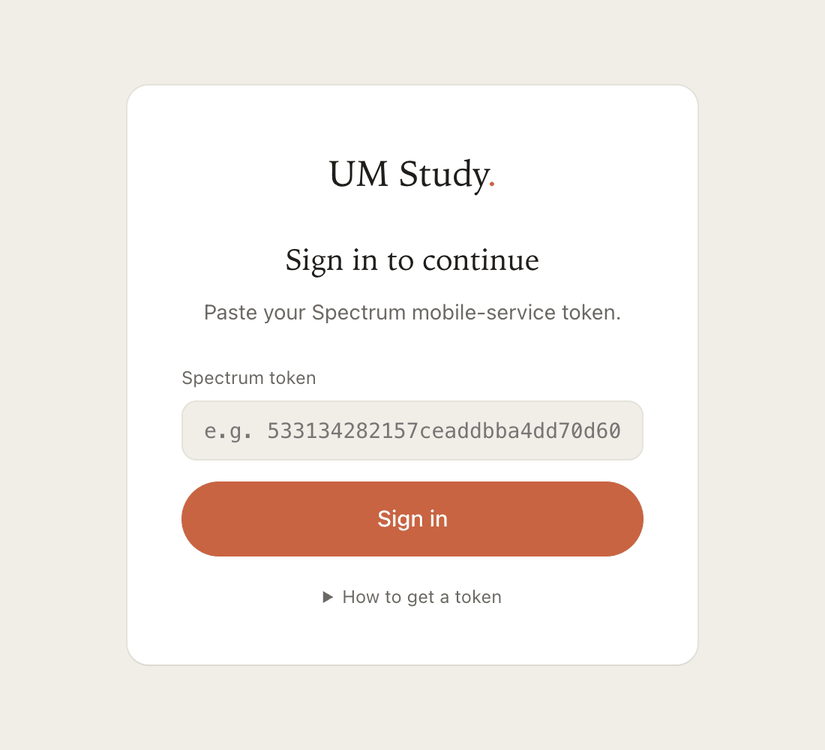
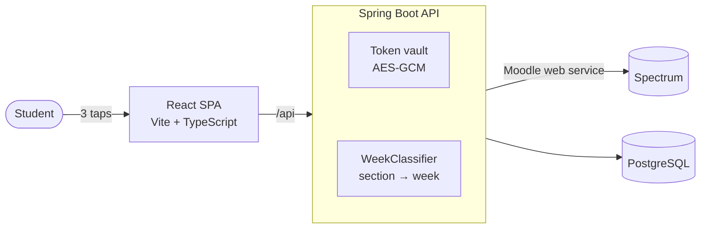

<h1 align="center">UM Study</h1>

<p align="center"><b>From login to the right file in three taps.</b></p>

<p align="center">
A week-aware companion to Spectrum, Universiti Malaya's course portal.<br>
Pick a course, pick a week, and see only that week's files.
</p>

<p align="center">
  <a href="#run-it-locally">Run locally</a> ·
  <a href="#how-it-works">How it works</a> ·
  <a href="docs/design/UM_Study_System_DevDoc.pdf">Design doc</a> ·
  <a href="docs/API.md">API</a>
</p>

<p align="center">
  
</p>

## Why

By Week 9, Spectrum lists every file a lecturer has ever uploaded in one long stream. Getting to this week's slides means scrolling past everything older, and that small friction is often why material gets opened the night before the exam. UM Study shows only what you need right now.

## Features

- **Jump to this week:** the current week is highlighted and one tap away. Weeks 1–14 sit in one grid, with the mid-semester break skipped.
- **Only this week's files:** filter by slides, tutorials, announcements or submissions.
- **Announcements in context:** each week shows its announcement count, rendered as text rather than downloads.
- **Upcoming submissions:** assignments and quizzes sorted by the closest deadline, with their status.
- **Named sections:** Project and Past Year Papers stay one tap away without cluttering the weeks.
- **Private by design:** your Spectrum token is encrypted at rest (AES-GCM).

<details>
<summary><b>More screenshots</b></summary>
<br>
<p align="center"></p>
<p align="center"></p>
<p align="center"></p>
</details>

## How it works



1. You sign in with your Spectrum mobile-service token. The backend verifies it with Spectrum and stores it encrypted.
2. The backend reads your courses and sections, and `WeekClassifier` tags each section with a week or a named bucket.
3. The app asks only for the week you picked, so each screen stays short.

More detail: [connecting to Spectrum](docs/SPECTRUM.md) · [API reference](docs/API.md) · [deployment](docs/DEPLOY.md)

## Run it locally

Try the UI with mock data. No backend or account needed:

```bash
cd frontend && npm install
VITE_USE_MOCK=true npm run dev    # → http://localhost:5173
```

<details>
<summary><b>Full stack with your own Spectrum data</b> (Java 21, Node 18+)</summary>
<br>

```bash
# Terminal 1: API on :8080 (dev profile, local H2 database)
cd backend && ./mvnw spring-boot:run

# Terminal 2: UI on :5173, proxies /api to the backend
cd frontend && npm install && npm run dev
```

Sign in with your token from **Spectrum → Profile → Preferences → Security keys → Moodle mobile web service**.
</details>

## Tech stack

| Layer | Tech |
|---|---|
| Frontend | React 18, TypeScript, Vite, React Router |
| Backend | Spring Boot 3.3, Java 21, Spring Security |
| Data | PostgreSQL via Supabase (migrations in `supabase/`), H2 locally |
| Integration | Spectrum (Moodle) web service |
| Deploy | Netlify (frontend) and Render (backend), see [DEPLOY.md](docs/DEPLOY.md) |

## Status

- [x] Sign-in, course picker, week picker, filtered file list
- [x] Live Spectrum data: files, announcements, assignments and quizzes
- [ ] Friendlier error states and a 404 page ([UX test findings](docs/design/UM_Study_UX_Test_Report.docx))
- [ ] Scheduled background scanning of course sections
